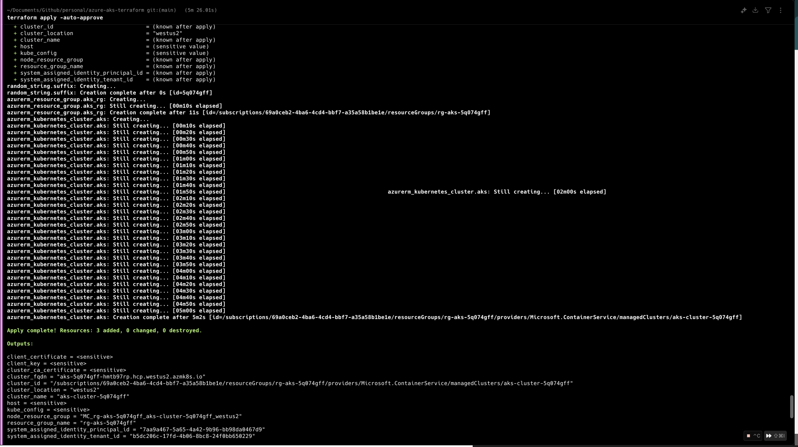

# Azure AKS Terraform Deployment Screenshots

This document contains screenshots from the Azure AKS (Azure Kubernetes Service) deployment using Terraform.

## Screenshots Overview

### 1. Terraform Output

_Terraform deployment output showing the successful creation of Azure resources_

### 2. Kubernetes Cluster

_Azure Kubernetes Service cluster overview and configuration_

### 3. Node Pool Configuration

_Node pool configuration showing 2 nodes in the AKS cluster_

## Screenshot Details

| Screenshot                        | Description                                                                 | File Size |
| --------------------------------- | --------------------------------------------------------------------------- | --------- |
| Terraform Output                  | Shows the successful Terraform deployment output with all created resources | 297KB     |
| Kubernetes Cluster                | Azure AKS cluster overview and management interface                         | 691KB     |
| Node Pool Configuration           | Node pool details showing 2 nodes configuration                             | 268KB     |
| Deployment Verification (9:03 PM) | First verification screenshot of the deployment                             | 152KB     |
| Deployment Verification (9:09 PM) | Second verification screenshot of the deployment                            | 297KB     |

## Notes

- All screenshots were taken during the Azure AKS deployment process
- The deployment appears to have been successful with proper resource creation
- Node pool is configured with 2 nodes as specified in the Terraform configuration
- Multiple verification screenshots were taken to document the deployment process

---

_Generated from screenshots folder in the Azure AKS Terraform project_
